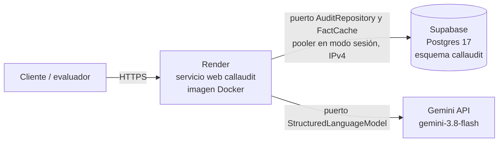

# Despliegue en producción

**URL pública:** https://services.mitnid.com (Swagger en `/docs`).

## Componentes



| Componente | Servicio | Plan | Región |
|---|---|---|---|
| API | Render (servicio web, runtime Docker) | Gratuito | Virginia (US East) |
| Base de datos | Supabase (Postgres 17.6) | Gratuito | us-east-1 |
| Modelo de lenguaje | Gemini API, `gemini-3.8-flash` | Gratuito | — |
| Dominio | `services.mitnid.com`, CNAME a `callaudit.onrender.com` | — | — |

La API y la base están en la misma región (costa este de Estados Unidos), para que cada consulta a la base haga un viaje corto.

## Render: infraestructura como código

El servicio está descrito en [`render.yaml`](../render.yaml) (Blueprint de Render):

- **Build:** con el mismo `Dockerfile` que se usa en local (multi-stage, usuario sin privilegios). Render inyecta `PORT` y termina TLS; uvicorn corre con `--proxy-headers`, así que las redirecciones usan `https`.
- **Despliegue automático:** en cada commit a `main` (`autoDeployTrigger: commit`).
- **Health check:** `/health`. Siempre responde 200 mientras el proceso está vivo; el estado de la base se informa en el cuerpo (`database: ok | error | no_configurada`), para que una caída de la base no provoque reinicios en bucle.

### Variables de entorno

| Variable | Valor | Dónde se define |
|---|---|---|
| `LLM_PROVIDER` | `gemini` | `render.yaml` |
| `LLM_MODEL` | `gemini-3.8-flash` | `render.yaml` |
| `LLM_REQUESTS_PER_MINUTE` | `4` | `render.yaml` |
| `LLM_MAX_CONCURRENCY` | `2` | `render.yaml` |
| `LLM_DAILY_CALL_BUDGET` | `100` | `render.yaml` |
| `CLIENT_REQUESTS_PER_HOUR` | `30` | `render.yaml` |
| `GEMINI_API_KEY` | Secreto | Panel de Render (`sync: false` en el Blueprint) |
| `DATABASE_URL` | Secreto: `postgresql+asyncpg://postgres.<ref>:<clave>@aws-0-us-east-1.pooler.supabase.com:5432/postgres` | Panel de Render (`sync: false`) |

Los secretos nunca están en el repositorio: el Blueprint los declara sin valor y Render los pide al crear el servicio.

## Supabase

- **Conexión por el pooler en modo sesión (puerto 5432):** el plan gratuito de Render solo tiene salida IPv4 y el host directo de Supabase es IPv6. El modo sesión conserva la conexión física, compatible con las sentencias preparadas de asyncpg.
- **Esquema propio `callaudit`** (fuera de la API REST pública de Supabase) con row level security activo en todas las tablas: `audit_runs`, `conversation_audits` y `fact_cache`.
- **Migraciones versionadas** en `supabase/migrations/`, aplicadas con el CLI:

```bash
supabase link --project-ref <ref>
supabase db push --dry-run     # muestra qué migraciones se aplicarían
supabase db push               # las aplica
supabase migration list        # local y remoto deben coincidir
```

Las mismas migraciones crean la base del stack local (`compose.yaml`).

## Cuota del modelo (tier gratuito)

Límites de `gemini-3.8-flash` en el proyecto de Google AI Studio: **5 llamadas por minuto, 250.000 tokens por minuto y 20 llamadas por día**, renovadas a la medianoche del Pacífico.

Cómo los respeta el servicio:

- **Ritmo:** 4 llamadas por minuto y 2 simultáneas, por debajo del límite.
- **Cuota diaria agotada:** se detecta en el detalle estructurado del error (`QuotaFailure` diaria). El servicio no reintenta y no vuelve a llamar al modelo hasta la renovación (Google cuenta también las peticiones rechazadas). Las conversaciones afectadas salen como `parcial` con la causa.
- **Caché de hechos:** una conversación idéntica a una ya analizada no llama al modelo. Auditar de nuevo el archivo de la prueba es instantáneo y no consume cuota; una conversación nueva o modificada sí la consume.

## Protección del gasto

La API es pública y sin autenticación, y la clave del modelo puede estar en el tier de pago. Tres capas limitan el gasto:

1. **Presupuesto diario del servicio (`LLM_DAILY_CALL_BUDGET=100`).** Antes de cada llamada al modelo, el servicio suma 1 a un contador por día UTC guardado en Postgres (`callaudit.llm_daily_usage`, incremento atómico con `insert ... on conflict do update ... returning`). Por encima del tope no llama al modelo: la conversación sale como `parcial` con el aviso. Vive en la base porque el plan gratuito reinicia el servicio al dormirlo y un contador en memoria se perdería. Si la base no responde, **no se llama al modelo** (falla cerrado). Con `gemini-3.8-flash`, 100 llamadas son unos USD 1,1 por día como máximo.
2. **Límite por cliente (`CLIENT_REQUESTS_PER_HOUR=30`).** Ventana deslizante por IP en las rutas `POST` de auditoría; responde 429 con `Retry-After`. Evita que un solo cliente consuma el presupuesto del día. Está en memoria y la IP reenviada puede falsearse, por eso no es la garantía de gasto (esa es la capa 1).
3. **Caché de hechos.** Las conversaciones ya analizadas no llaman al modelo ni consumen presupuesto.

En Google Cloud, además: una alerta de presupuesto en la cuenta de facturación y la API key restringida a la API de Gemini.

## Verificación después de un despliegue

Ninguna de estas consultas llama al modelo:

```bash
curl https://services.mitnid.com/health       # modelo, persistencia y "database": "ok"
curl https://services.mitnid.com/v1/rubric    # 21 criterios
curl https://services.mitnid.com/v1/audits/00000000-0000-0000-0000-000000000000   # 404 desde la base
```

## Limitaciones del plan gratuito

- **Arranque en frío:** Render detiene el servicio tras unos 15 minutos sin tráfico; la primera petición siguiente tarda cerca de un minuto.
- **Pausa de Supabase:** los proyectos gratuitos se pausan tras una semana sin actividad. Auditar sigue funcionando (sin guardar ni usar el caché), y las consultas de auditorías guardadas responden 503 hasta reactivarlo.
- **Volumen:** con 20 llamadas diarias al modelo, lotes grandes de conversaciones nuevas requieren varios días o el tier de pago (ver [costos.md](costos.md)).
